# agentic-org

<p align="center">
  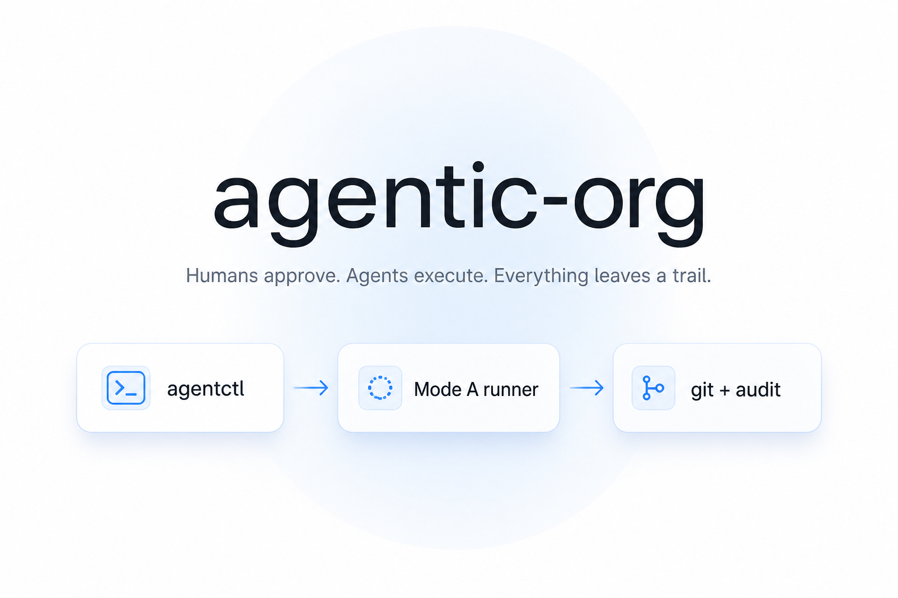
</p>

<p align="center">
  <strong>Humans approve. Agents execute. Everything leaves a trail.</strong><br/>
  Local-first control plane for budgeted, auditable, reversible AI feature work.
</p>

<p align="center">
  <a href="#try-it-in-2-minutes"></a>
  <a href="#use-case-bulk-member-import"></a>
  <a href="#architecture--flow"></a>
  <a href="#skills--personas--orchestration"></a>
  <a href="#four-guarantees"></a>
  
</p>

---

Not a chat wrapper. A **workflow control plane** so humans and agents can ship features from intake through planning (Mode A) with four enforceable guarantees — and **never fabricate LLM success** when a model is unavailable.

## The difference (why people switch)

<p align="center">
  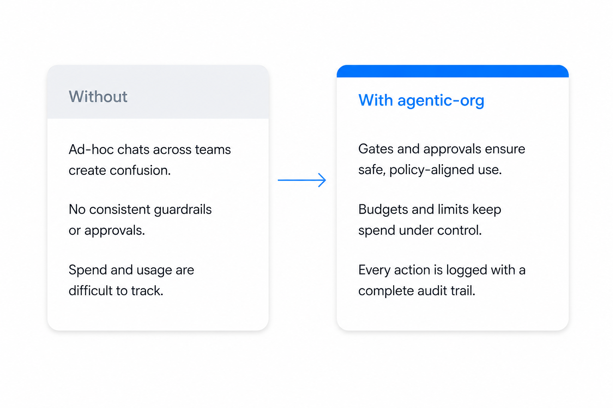
</p>

<p align="center">
  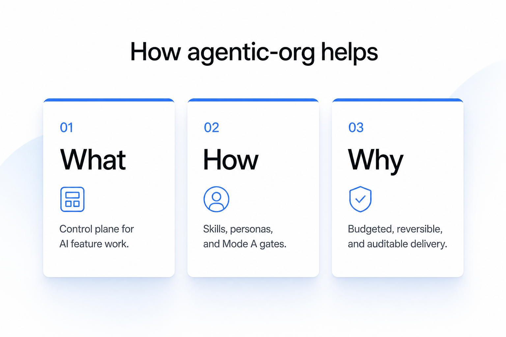
</p>

| Without agentic-org | With agentic-org |
| ------------------- | ---------------- |
| Prompt → hope → maybe code | Intake → map → brain → **human gate** → plan → implement |
| Spend is invisible | Guardrails hard-stop on USD / tokens / tools |
| “Done” with no proof | Hash-chained events + `agentctl verify` |
| Hard to undo agent edits | Git checkpoints + one-click revert |
| Agents keep going past judgment calls | Plan / release **cannot** bypass humans |

## Architecture & flow

<p align="center">
  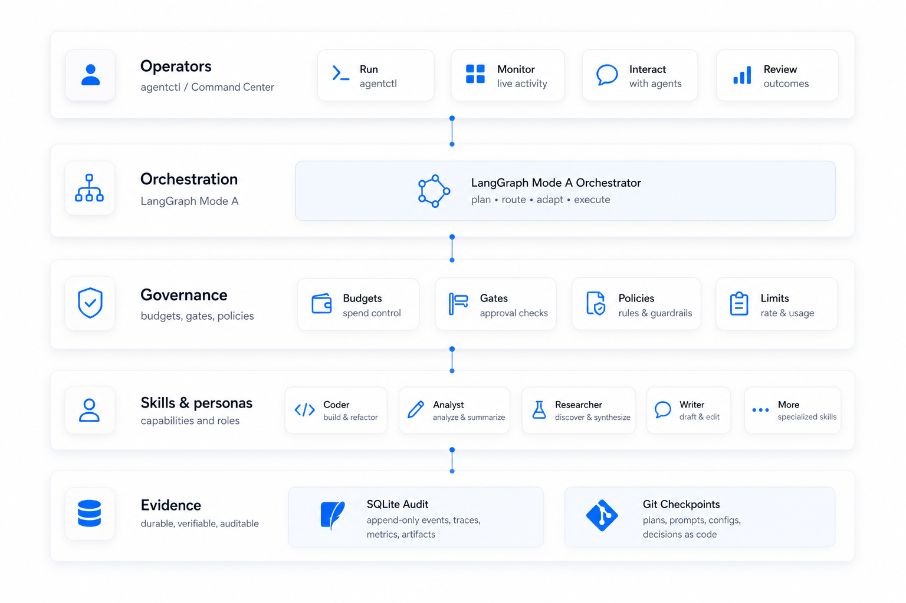
</p>

<p align="center">
  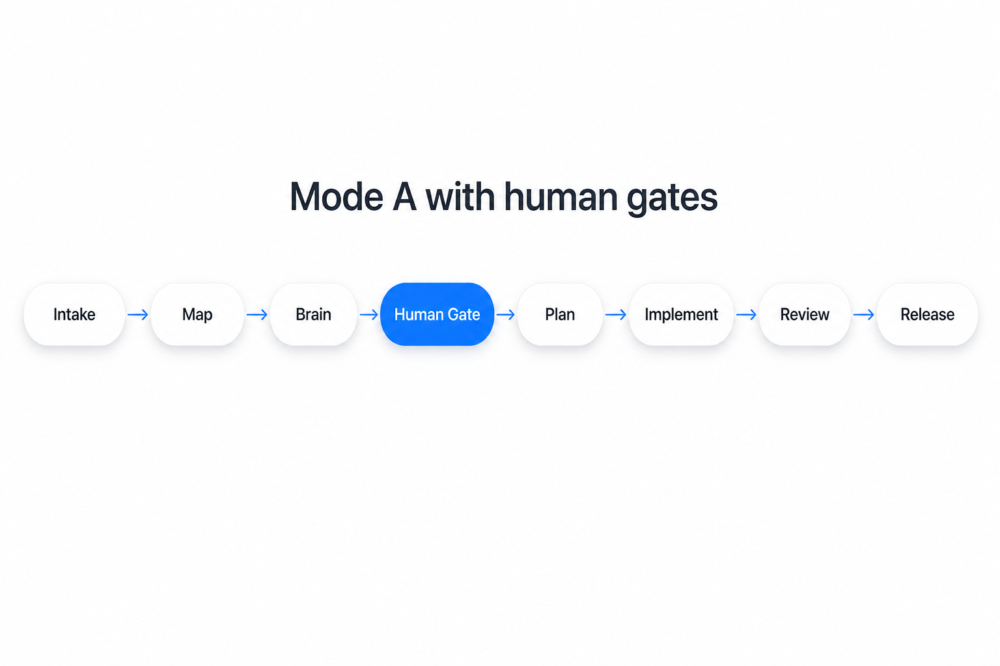
</p>

<p align="center">
  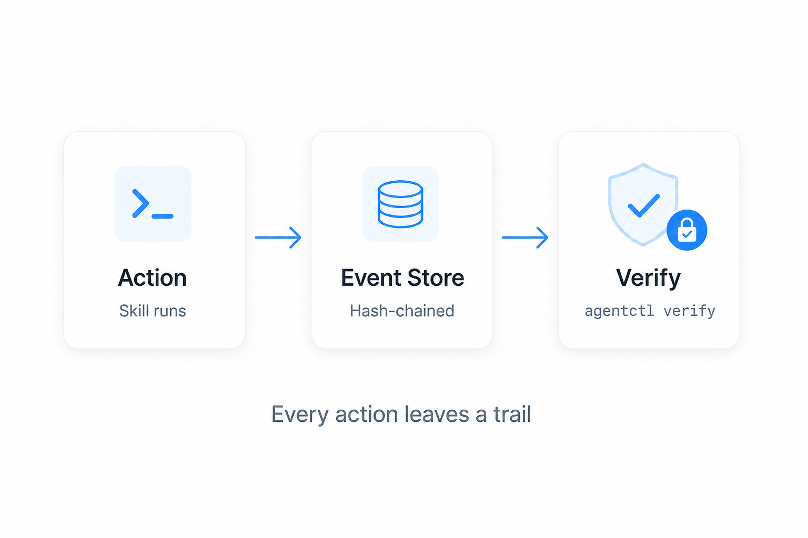
</p>

```text
agentctl / command-center UI
        │
        ▼
   FastAPI + context wiring ──► SQLite (events, workflows, budgets)
        │
        ▼
   LangGraph Mode A runner ──► skills, personas, model gateway
        │
        ▼
   Target git repository (checkpoints / worktrees)
```

## Skills, personas, orchestration

Every skill ships a deterministic script and a registered eval. Personas bind those skills and list gates that must pass before they commit work. Orchestration coordinates the loop without skipping humans.

<p align="center">
  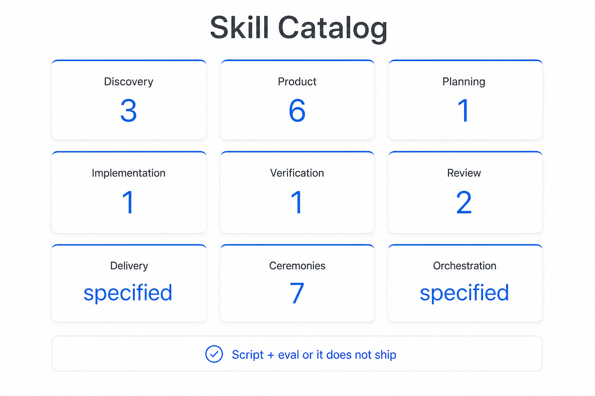
</p>

<p align="center">
  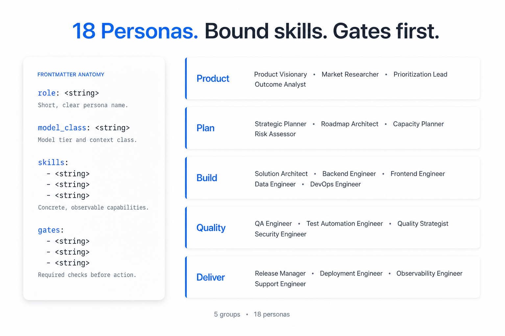
</p>

<p align="center">
  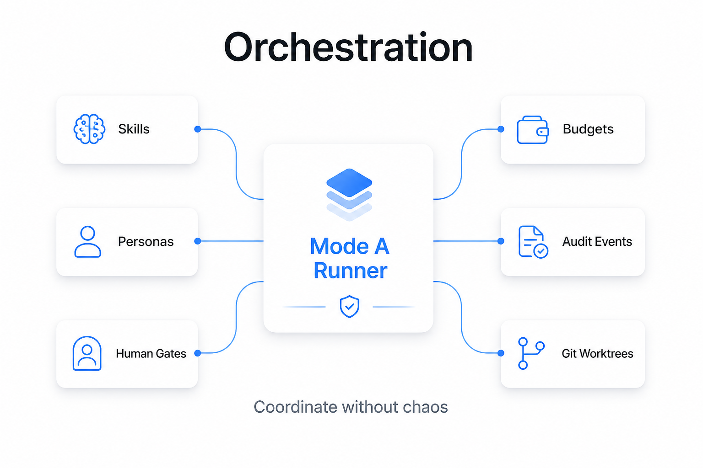
</p>

| Layer | What ships today |
| ----- | ---------------- |
| **Skills** | 21 executable skills across discovery, product, planning, implementation, verification, review, ceremonies |
| **Personas** | 18 role cards with domain context, bound skills, ceremony participation, handoffs |
| **Orchestration** | Mode A runner + human gates + budgets + hash-chained events |

Catalog: [`docs/SKILL_CATALOG.md`](docs/SKILL_CATALOG.md) · Install notes: [`docs/SKILLS.md`](docs/SKILLS.md)

## Live Command Center (real UI)

Captured from the included **bulk-member-import** use case — workflow paused at a human gate with budget `$0 / $8` still enforceable.

<p align="center">
  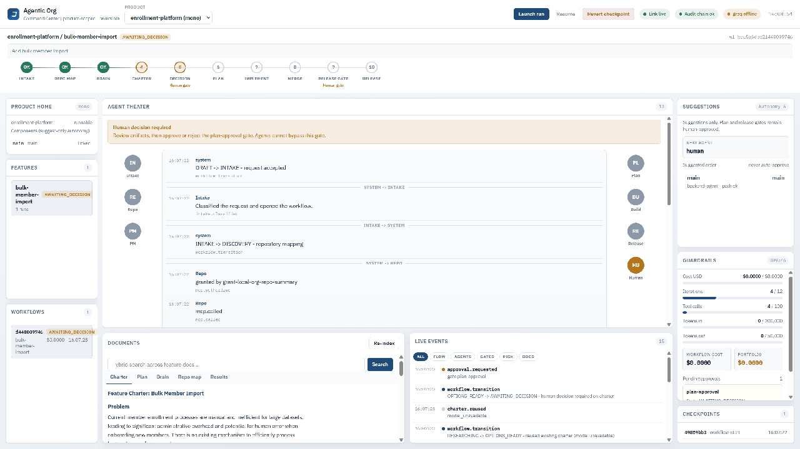
</p>

<details>
<summary><strong>Static screenshots</strong></summary>

**1. Human gate — agents stop; you decide**

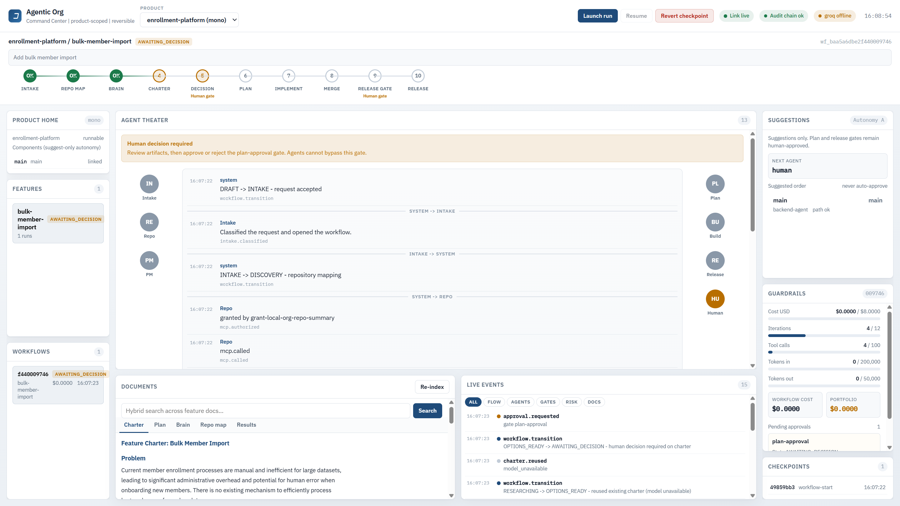

**2. Repo map — what the system actually found**

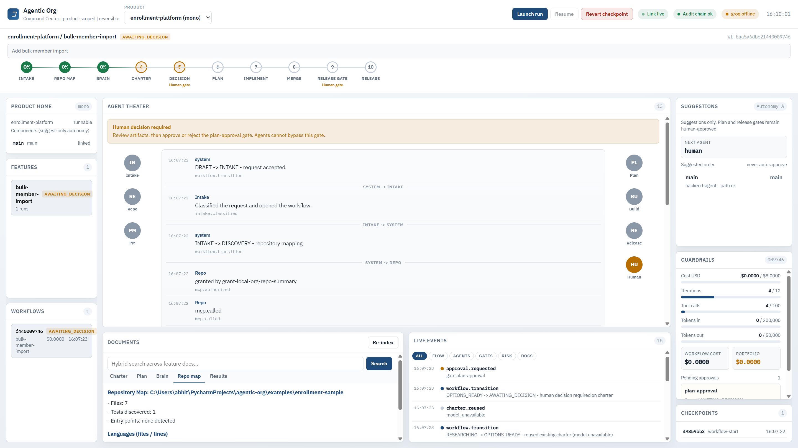

**3. Guardrails + gate events**

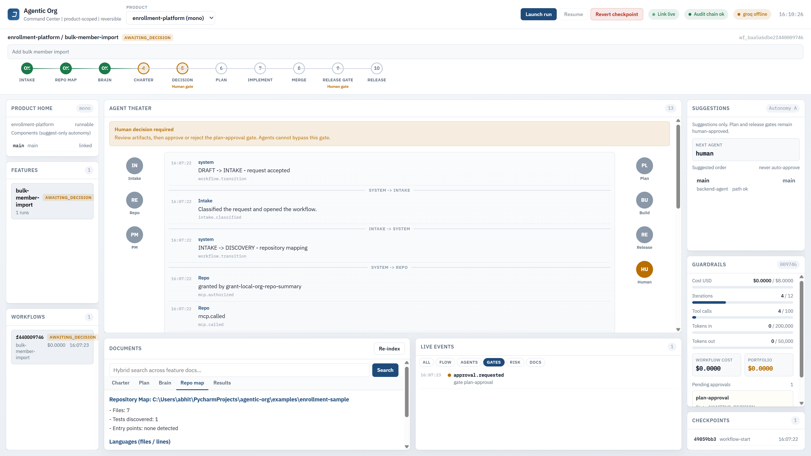

</details>

## Use case: bulk member import

**Goal:** Add bulk member import to a tiny enrollment sample app — with a human approval before planning continues.

**What you will see**

1. **Intake / Repo Map / Brain** run without inventing progress.
2. Workflow lands on **AWAITING_DECISION** (plan-approval human gate).
3. Command Center shows Agent Theater, Documents (charter / repo map), Guardrails, Checkpoints.
4. You approve/reject — agents cannot skip the gate.

Full walkthrough: [`docs/demo/bulk-member-import-walkthrough.md`](docs/demo/bulk-member-import-walkthrough.md)

## Try it in 2 minutes

```powershell
git clone https://github.com/Abhitodan/agentic-org.git
cd agentic-org
python -m venv .venv
.\.venv\Scripts\python.exe -m pip install -e ".[dev]"

# Demo target repo
.\.venv\Scripts\python.exe scripts\create_sample_repo.py

# Mode A vertical slice (honest without a model key)
agentctl init
agentctl create-project enrollment-platform --repo .\examples\enrollment-sample
agentctl create-feature enrollment-platform bulk-member-import --objective "Add bulk member import"
agentctl run enrollment-platform bulk-member-import --budget-usd 8

agentctl status
agentctl verify
agentctl serve            # http://127.0.0.1:8787
```

macOS / Linux:

```bash
git clone https://github.com/Abhitodan/agentic-org.git
cd agentic-org
python -m venv .venv
source .venv/bin/activate
pip install -e ".[dev]"
python scripts/create_sample_repo.py
agentctl init
agentctl create-project enrollment-platform --repo ./examples/enrollment-sample
agentctl create-feature enrollment-platform bulk-member-import --objective "Add bulk member import"
agentctl run enrollment-platform bulk-member-import --budget-usd 8
agentctl serve   # http://127.0.0.1:8787
```

Open the Command Center, click the workflow in **AWAITING_DECISION**, review the charter / repo map, then:

```powershell
agentctl approve <workflow_id>
```

Optional LLM charter/plan quality (not required to try the product):

```powershell
copy .env.example .env
# put your Gemini API key in GEMINI_API_KEY
```

## Four guarantees

| Guarantee | What it means |
| --------- | ------------- |
| **Evidence over claims** | If the model cannot run, the workflow goes `BLOCKED` / waits honestly — never a fake completion |
| **Everything reversible** | Git checkpoints before modifications; restore without rewriting history |
| **Everything budgeted** | Workflows carry a budget; overspend is a hard stop |
| **Everything auditable** | Append-only, hash-chained events (`agentctl verify`) |

## How it helps (concrete)

- **Leads / staff engineers:** See cost, gates, and checkpoints before agent code lands on main.
- **ICs using coding agents:** Keep a reversible trail instead of a chat scrollback.
- **Teams evaluating “agentic” tools:** Fail-closed behavior is testable offline — clone and run without buying a model key.

## Limitations

See [docs/LIMITATIONS.md](docs/LIMITATIONS.md). High level: live model quality is yours to evaluate; no SSO; loopback-first command center; costs in `models.yaml` are estimates.

## Contributing / Security / License

- [CONTRIBUTING.md](CONTRIBUTING.md) — run `pytest` before PRs that touch guarantees  
- [SECURITY.md](SECURITY.md) — secrets only via environment variables  
- [LICENSE](LICENSE) — terms not yet finalized (placeholder)
