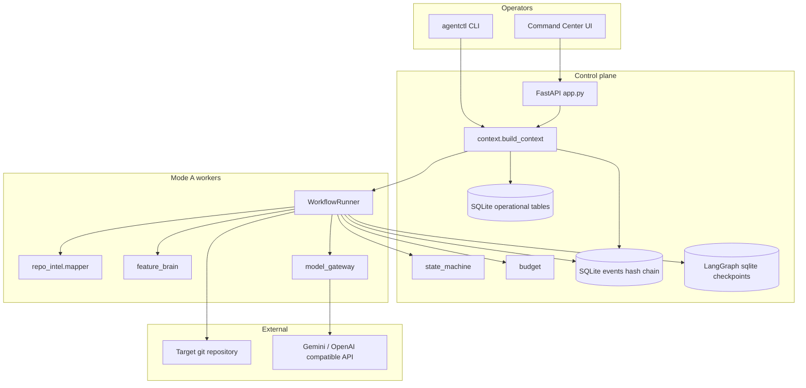
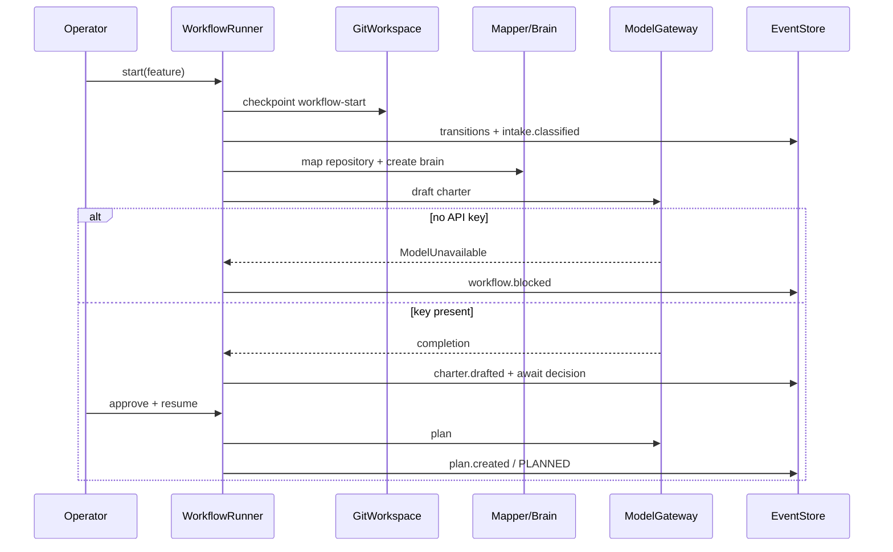

# Architecture

## Intent

`agentic-org` is a **local-first control plane** for AI-assisted software feature work. The runtime vertical slice (Mode A) runs from intake through planning with human approval, budgets, audit events, and git checkpoints.

## System architecture

## Execution flow (Mode A)

## Module map

| Path | Responsibility | Notes |
| ---- | -------------- | ----- |
| `cli/main.py` | Operator commands | Typer |
| `api/app.py` | HTTP + SSE + actions | Optional mutating token auth |
| `orchestrator/runner.py` | LangGraph Mode A | Hardcoded pipeline (not YAML-driven yet) |
| `core/*` | Events, FSM, budget, store, DB | Strongest tested core |
| `gateway/model_gateway.py` | Completions + cost | Fail-closed |
| `repo_intel/mapper.py` | Deterministic inventory | No LLM |
| `brain/feature_brain.py` | Markdown/YAML brain | 22 sections |
| `workspace/git_ws.py` | Checkpoints/worktrees | `subprocess` git |
| `.agent-org/` | Governance artifacts | Many files describe future modes |

## Configuration

| Source | Purpose |
| ------ | ------- |
| `.env` / env vars | API keys, optional `AGENTIC_ORG_API_TOKEN`, root override |
| `.agent-org/models.yaml` | Provider, model classes, unit prices |
| `.agent-org/budgets.yaml` | Defaults |
| `AGENTIC_ORG_ROOT` | Workspace root containing `.agent-org/` |

## Security boundaries

- **Trust domain:** Local operator machine by default (`127.0.0.1`).
- **Secrets:** Environment only; must not appear in events/brains.
- **Mutations:** When `AGENTIC_ORG_API_TOKEN` is set, POST/PUT/PATCH/DELETE on `/api/*` require the token. GET/SSE remain open for the dashboard.
- **Git:** Checkpoint restore uses `git reset --hard` to tagged refs.
- **MCP:** Permission files are not enforced by runtime code yet.

## Deployment assumptions

- Python ≥ 3.11, git on PATH, local SQLite files under `.agent-org/state/`.
- No container/orchestrator required for MVP.
- Not multi-tenant; not SSO-protected.

## Related ADRs

- ADR-001 Event-sourced SQLite core
- ADR-002 LangGraph orchestration
- ADR-003 Git-native reversibility
- ADR-004 Vendor-neutral governance
- ADR-005 OpenAI-compatible gateway
- ADR-006 Live command-center surface
