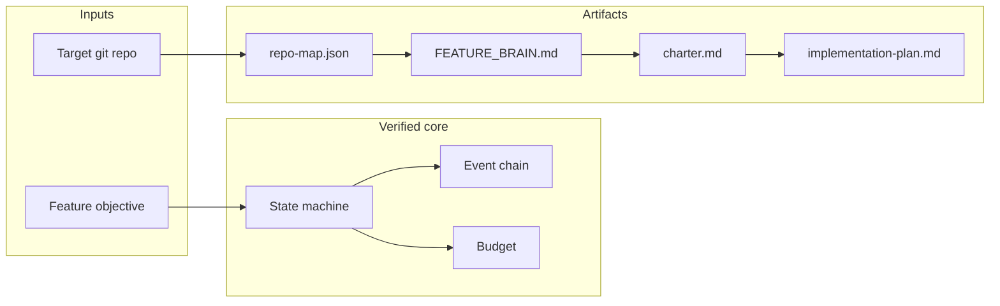
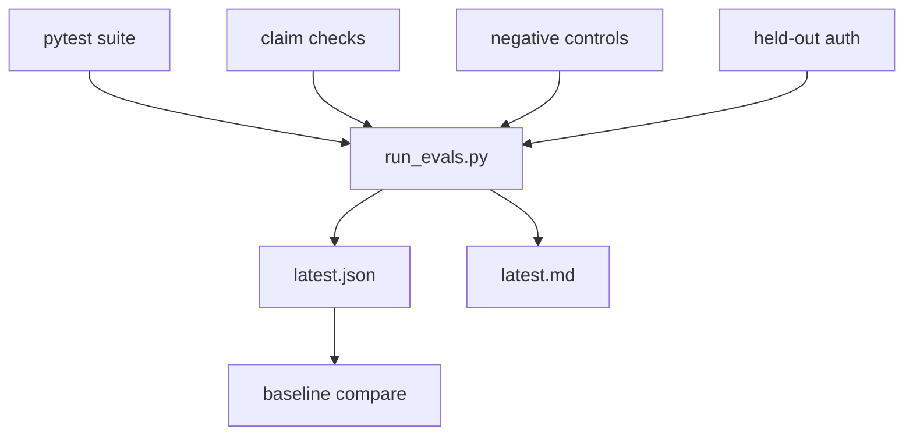

# Project Showcase — agentic-org

## Executive overview

**agentic-org** is a local control plane for AI-assisted software features. It
runs a budgeted Mode A workflow (intake → repository map → feature brain →
charter gate → plan) with hash-chained audit events and git checkpoints. It
refuses to invent LLM output when no model is configured.

| | |
| -- | -- |
| Version | 0.1.0 |
| Primary interface | `agentctl` CLI + command center at `127.0.0.1:8787` |
| Core guarantee tests | pytest + `evals/run_evals.py` |
| Maturity | Local MVP — not multi-tenant enterprise |

## Problem → solution

| Problem | What agents usually do | What agentic-org does |
| ------- | ---------------------- | --------------------- |
| Unaudited agent actions | Chat logs only | Append-only hash-chained events |
| Silent spend | Unlimited API calls | Budget object with hard stops |
| Irreversible edits | Hope / manual undo | Git checkpoint tags + restore |
| Fake success | “Done” without evidence | `BLOCKED` when model unavailable |

## Key concepts

- **Mode A** — Existing-feature vertical slice through planning.
- **Feature brain** — 22-section git-versioned markdown/yaml memory per feature.
- **Human gate** — Explicit approval before planning continues.
- **Governance tree** — `.agent-org/` constitution, policies, role docs (design intent; not all executable yet).

## Repository architecture

See [`ARCHITECTURE.md`](ARCHITECTURE.md) for Mermaid system and sequence diagrams.

## Workflow explanation

1. `create-project` / `create-feature` register entities and brain scaffolding.
2. `run` executes LangGraph nodes until a human gate or block.
3. Deterministic nodes always attempt real work (map, brain, checkpoint).
4. LLM nodes call the gateway or block with reason.
5. `approve` + `resume` continue past the gate when credentials exist.
6. `verify` recomputes the event hash chain.

## Concrete use cases

1. **Local feature intake** on a sample enrollment repo without spending API budget.
2. **Auditable planning** once `GEMINI_API_KEY` is set (path coded; quality unverified in CI).
3. **Rollback drill** via `checkpoint` / `revert` on the target repository.
4. **Operator dashboard** watching workflows/costs over SSE.

## Verified results (this environment)

| Check | Result | Evidence |
| ----- | ------ | -------- |
| pytest | Passed (see latest run) | Command output |
| Honesty without key | `BLOCKED` + artifacts | `tests/test_workflow_e2e.py`, eval scenario |
| Tamper detection | Chain invalid after mutate | `tests/test_events.py` |
| Mutating API token | 401 without / ok with | `evals/regression_tests` |
| Graph memory runtime | Absent (negative control pass) | `evals/cases/claims.json` |

Numbers are not invented: open `evals/reports/latest.json` after running the harness.

## Comparison with reasonable baselines

| Approach | Audit trail | Budget hard stop | Fail-closed w/o model | Git rollback | Local CLI |
| -------- | ----------- | ---------------- | --------------------- | ------------ | --------- |
| Raw ChatGPT/Claude chat | Weak | No | N/A | Manual | No |
| Ad-hoc agent script | Optional logs | Rare | Often fabricates | Manual | Varies |
| **agentic-org Mode A** | Hash chain | Yes | Yes | Checkpoint tags | Yes |

This is a capability comparison, not a published benchmark contest.

## Limitations and known risks

Summarized in [`LIMITATIONS.md`](LIMITATIONS.md). Highlights: implement/merge/release
exist but are not a full multi-agent org; optional API auth for mutations;
no SSO; LLM quality unverified; MCP library not required on every runner hop.

## Evaluation methodology

[`EVALUATION_METHOD.md`](EVALUATION_METHOD.md) and [`../evals/README.md`](../evals/README.md).

## Expert findings (compressed)

| Expert | Strongest | Weakest assumption |
| ------ | --------- | ------------------ |
| ML researcher | Fail-closed gateway | Cost/quality from untested live path |
| Eval scientist | Honest assessment docs | Prior lack of harness |
| Architect | Shared CLI/API core | YAML implies execution |
| Reliability | Checkpointed graph | Scale unmeasured |
| Security | Env-only secrets | Default unauth mutations |
| Product | Concrete demo path | “Organization” framing vs MVP |
| DX/OSS | ADRs + contributing + CI | Live LLM job optional/skipped without secret |
| Skeptic | Explicit unverified LLM | Prior marketing adjectives |

Full debate: [`SCIENTIFIC_AUDIT.md`](SCIENTIFIC_AUDIT.md).

## Risk assessment

| Risk | Likelihood | Impact | Treatment |
| ---- | ---------- | ------ | --------- |
| Overclaim drift in docs | Medium | High | `negative.readme_overclaims` |
| Exposed serve without token | Medium | High | Refuse non-loopback without token |
| LLM path untested | High | Medium | Roadmap experiment #1 |
| SQLite concurrency | Low (single user) | Medium | Stay local; revisit |

## Roadmap

[`ROADMAP.md`](ROADMAP.md) — CI, live Mode A validation, implementation node, MCP enforcement.

## Contribution opportunities

1. Add GitHub Actions for pytest + evals.
2. Capture a redacted live Gemini transcript fixture.
3. Implement worktree-backed coding node with tests as gate.
4. Enforce MCP deny-by-default in runtime.
5. Browser E2E for command center approvals.

See [`../CONTRIBUTING.md`](../CONTRIBUTING.md) and `.github/ISSUE_TEMPLATE/`.
